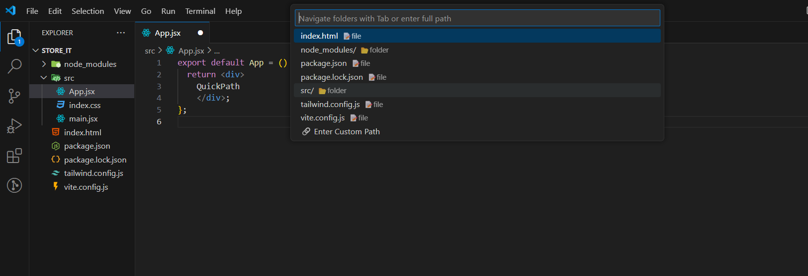

# QuickPath

QuickPath is a Visual Studio Code extension that allows you to quickly create files and folders using just your keyboard. It simplifies your development workflow by eliminating the need to navigate through multiple menus or use the mouse.

## Features

- Quickly create new files and folders without leaving your keyboard.
- Supports nested folder structures.
- Intuitive command palette integration.

## Installation

1. Open **Visual Studio Code**.
2. Go to the **Extensions** view by clicking on the Extensions icon in the Activity Bar on the side of the window.
3. Search for `QuickPath`.
4. Click **Install** on the QuickPath extension by [Pranto-Paul](https://github.com/Pranto-Paul).

## Usage

1. Open the Command Palette:
   - On Windows/Linux: `Ctrl+Alt+N`
   - On macOS: `Cmd+Option+N`
2. Type `QuickPath: Create File or Folder` and select it.
3. Enter the desired file or folder path (e.g., `src/components/Button.js` or `assets/images/`).
4. Press `Enter` to create the specified file or folder structure.

## Requirements

No additional requirements or dependencies.

## Extension Settings

This extension does not contribute any settings.

## Known Issues

Currently, there are no known issues. If you encounter any problems, please [open an issue](https://github.com/Pranto-Paul/QuickPath/issues).

## Release Notes

### 1.0.0

- Initial release of QuickPath.

## License

MIT License

Copyright (c) [2025] [Pranto Paul]

Permission is hereby granted, free of charge, to any person obtaining a copy of this software and associated documentation files (the "Software"), to deal in the Software without restriction, including without limitation the rights to use, copy, modify, merge, publish, distribute, sublicense, and/or sell copies of the Software, and to permit persons to whom the Software is furnished to do so, subject to the following conditions:

The above copyright notice and this permission notice shall be included in all copies or substantial portions of the Software.

THE SOFTWARE IS PROVIDED "AS IS", WITHOUT WARRANTY OF ANY KIND, EXPRESS OR IMPLIED, INCLUDING BUT NOT LIMITED TO THE WARRANTIES OF MERCHANTABILITY, FITNESS FOR A PARTICULAR PURPOSE AND NONINFRINGEMENT. IN NO EVENT SHALL THE AUTHORS OR COPYRIGHT HOLDERS BE LIABLE FOR ANY CLAIM, DAMAGES OR OTHER LIABILITY, WHETHER IN AN ACTION OF CONTRACT, TORT OR OTHERWISE, ARISING FROM, OUT OF OR IN CONNECTION WITH THE SOFTWARE OR THE USE OR OTHER DEALINGS IN THE SOFTWARE.

## Contributing

Contributions are welcome! Please fork the repository and submit a pull request.

## License

[MIT](LICENSE)
